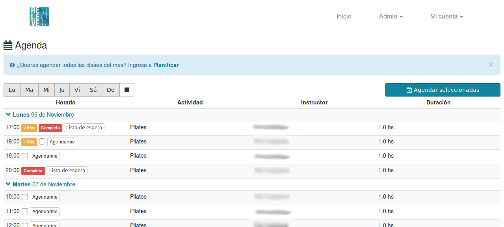

Web Scheduling API
---------------------

This is a **webapp** for a local business developed with [Ruby on Rails](http://rubyonrails.org/) and [AngularJs](https://angularjs.org/).
You can check the production site at http://www.relevepilates.com.ar/

## Landing page ##
The site has a landing page with all the necessary information for the clients including comments, photo gallery, activities, map a contact form.

 - Responsive design built using [Bootstrap](http://getbootstrap.com/) framework and **HTML5** Semantic Elements.
 - [Google Maps API](https://developers.google.com/maps/) is being used to show the location.
 - [Facebook API](https://developers.facebook.com/) is being used to display the Like Button and contacts following the site.
 - [schema.org](http://schema.org/) presenting the buisness data for search engines.
 - [reCAPTCHA](https://www.google.com/recaptcha/intro/android.html) protects contact form and website from spam and abuse.
 - [Google Analytics](https://analytics.google.com/) tracks and reports website traffic.

## User authentication ##
This API offers three different ways for the user to authenticate: Facebook, Twitter and email account.

 - [OmniAuth](https://github.com/omniauth/omniauth) library is used for Multi-Provider Authentication. In this case, [Twitter](https://twitter.com/) and [Facebook](https://www.facebook.com/) were selected considering the clients.
 - [Rails Devise](https://github.com/plataformatec/devise) gem was used to provide an alternative way of authentication with the email address.

## Scheduling API ##
The Scheduling API handles different users profiles and plans allowing them to schedule the activities available.

The API was developed using:

 - A [PostgreSQL](https://www.postgresql.org/) database containing user info and activities.
 - A [Ruby on Rails](http://rubyonrails.org/) web server that responds to [CRUD](https://en.wikipedia.org/wiki/Create,_read,_update_and_delete) operations, authenticates the user and connects to the database.
 - [AngularJs](https://angularjs.org/) + [Bootstrap](http://getbootstrap.com/)  user interface.
